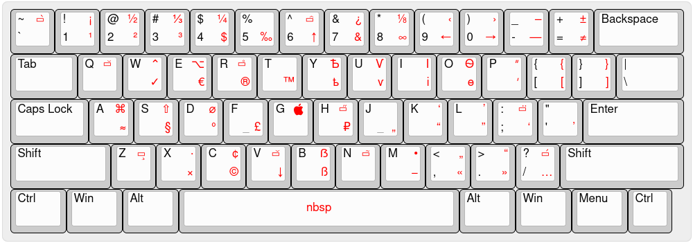

🇷🇺 [На русском](README.ru.md)

# xkb-birman
Birman typography layouts (ver. 3.7) for linux



### Standard xkb `typo` and other solutions

Xkb already have `typo` option that similar to [Birman's layout](https://ilyabirman.ru/projects/typography-layout/)
and can be using with any other layouts. 
In some distros it can be enabled from DE GUI apps but XFCE (on november 2021).
One of the common way to enable this layout is to add `misc:typo`
parameter  to `XkbOptions`.

In file `/etc/X11/xorg.conf.d/00-keyboard.conf`:

```
Section "InputClass"
	Identifier "system-keyboard"
	MatchIsKeyboard "on"
	Option "XkbLayout" "us,ru"
	Option "XkbOptions" "grp:alt_shift_toggle,lv3:ralt_switch,misc:typo"
EndSection
```

But this file can be overwritten by some apps 
(ex. `localectl`, [Arch Wiki](https://wiki.archlinux.org/title/Xorg/Keyboard_configuration#Using_X_configuration_files))

So better to do it with `setxkbmap`:

```bash
setxkbmap -layout "us,ru" -option "grp:alt_shift_toggle,lv3:ralt_switch,misc:typo"
```

You should run  this command at start of x session (e.x. in `~/.xprofile`).

Difference of this repo layout from xkb `typo` layout is that this layout exactly corresponds to Birman's version 3.7. 
Compare youself: 
[Xkb Typo Layout](http://www.keyboard-layout-editor.com/#/gists/fa53295a41acaabfdd26ec579e7fef00), 
[Birman Layout](http://www.keyboard-layout-editor.com/#/gists/d6688ffd91801960f0cc66aa615c1797)

Greate thanks authors of repos:

1. [https://github.com/isqua/xkb-birman-layout](https://github.com/isqua/xkb-birman-layout)
2. [https://github.com/neochief/birman-typography-layouts-for-ubuntu](https://github.com/neochief/birman-typography-layouts-for-ubuntu)

Difference of this repo is that you don't need to edit system files [1] 
and you can apply layout on any other lang (not only us and ru) 
and flag in applet should be work [2] like with `misc: typo`.


### Installation:

```bash
# clone this repo (or just download it)
git clone https://github.com/Sherevv/xkb-birman.git
cd xkb-birman

# Create directory for your own layouts
mkdir -p ~/.config/xkb/symbols/

# Put this layout to your home directory
cp birman ~/.config/xkb/symbols/
```

Add this code to run with session start

```bash
setxkbmap -layout "us+birman,ru:2+birman" -option "grp:alt_shift_toggle,lv3:ralt_switch" -print | xkbcomp -I${HOME}/.config/xkb - $DISPLAY
```

`grp:alt_shift_toggle` means switch layouts by press `Alt+Shit`. You may set up other keys,
see other options in `/usr/share/X11/xkb/rules/base.lst` file under `! option` block.


Or you can use install script. It creates `~/.config/xkb/symbols/` dir, copies `birman` file and adds `setxkbmap` command to `~/.xprofile`, activates layout.
```bash
./install.sh
```


