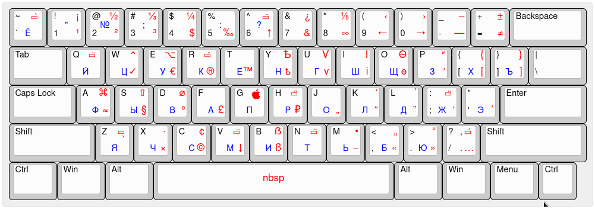

🇺🇸 [English](README.md)

# xkb-birman
Типографская раскладка Ильи Бирмана (версия 3.7) для Linux
        


### Стандартная раскладка `typo` и другие решения

В xkb уже есть раскладка `typo`, которая очень похожа на [раскладку Бирмана](https://ilyabirman.ru/projects/typography-layout/).
Она может быть использована с любой другой раскладкой (не только русской и английской). 
В некоторых дистрибутивах её можно включить в настройках клавиатуры.
Но не в XFCE (по состоянию на ноябрь 2021).
Один из вариантов включения этой раскладки — добавить параметр `misc:typo`
в `XkbOptions`.

В файле `/etc/X11/xorg.conf.d/00-keyboard.conf` нужно прописать:

```
Section "InputClass"
	Identifier "system-keyboard"
	MatchIsKeyboard "on"
	Option "XkbLayout" "us,ru"
	Option "XkbOptions" "grp:alt_shift_toggle,lv3:ralt_switch,misc:typo"
EndSection
```

Но этот файл может быть перезаписан другими приложениями  
(например, `localectl`, см. [Arch Wiki](https://wiki.archlinux.org/title/Xorg/Keyboard_configuration#Using_X_configuration_files))

Поэтому лучше это сделать через `setxkbmap`:

```bash
setxkbmap -layout "us,ru" -option "grp:alt_shift_toggle,lv3:ralt_switch,misc:typo"
```

Эту команду надо запускать вместе со стартом X сессии (например, прописать в файле `~/.xprofile`).

Данная раскладка отличается от `typo` тем, что она полностью соответствует раскладке Бирмана версии 3.7.
Сравните самостоятельно:
[Раскладка Xkb Typo](http://www.keyboard-layout-editor.com/#/gists/fa53295a41acaabfdd26ec579e7fef00),
[Раскладка Бирмана](http://www.keyboard-layout-editor.com/#/gists/714029315f63eac7364d7eb3c413ef3c)

Огромная благодарность авторам следующих репозиториев:

1. [https://github.com/isqua/xkb-birman-layout](https://github.com/isqua/xkb-birman-layout)
2. [https://github.com/neochief/birman-typography-layouts-for-ubuntu](https://github.com/neochief/birman-typography-layouts-for-ubuntu)

От их решений она отличается тем, что нет необходимости править системные файлы и 
есть возможность использовать её с любой другой раскладкой (не только русской и английской), 
как это реализовано для раскладки `typo`. 
Клавиатурный апплет XFCE корректно отображает флаги.


### Установка:

```bash
# клонируйте репозиторий (или просто скачайте его)
git clone https://github.com/Sherevv/xkb-birman.git
cd xkb-birman

# создайте в домашней директории папку для раскладки
mkdir -p ~/.config/xkb/symbols/

# скопируйте туда файл раскладки
cp birman ~/.config/xkb/symbols/
```

Добавьте следующий код на выполнение при загрузке системы.

```bash
setxkbmap -layout "us+birman,ru:2+birman" -option "grp:alt_shift_toggle,lv3:ralt_switch" -print | xkbcomp -I${HOME}/.config/xkb - $DISPLAY
```

`grp:alt_shift_toggle` означает, что переключение раскладки осуществляется комбинацией `Alt+Shit`. 
Другие варианты переключений можно посмотреть в файле `/usr/share/X11/xkb/rules/base.lst` под блоком `! option`.

Либо вы можете воспользоваться готовым скриптом, который создаст папку `~/.config/xkb/symbols/`, скопирует туда файл `birman`, добавит команду `setxkbmap` в `~/.xprofile` и активирует раскладку.
```bash
./install.sh
```
